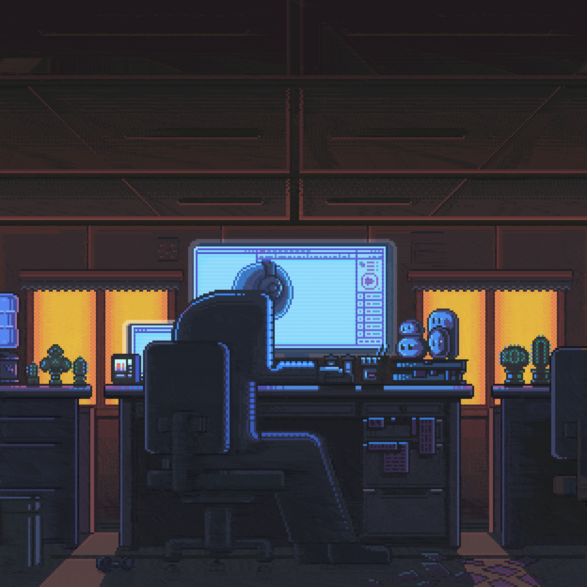

<div align="center">
<a href="https://github.com/[theprincepratap]" target="_blank">
  
</a>
<a href="https://linkedin.com/in/[theprincepratap]" target="_blank">
  
</a>
<a href="https://instagram.com/[theprincepratap_]" target="_blank">
  
</a>
<a href="https://[theprincepratap.dev]" target="_blank">
  
</a>
<a href="mailto:[theprincepratap@gmail.com]" target="_blank">
  
</a>

<br/><br/>


</div>

<br/>

## 🚀 About Me

```python
class Developer:
    def __init__(self):
        self.name = "[PRINCE KUMAR]"
        self.role = "[AI ENGINEER || CONTENT CREATOR]"
        self.stack = ["Python", "Django", "FastAPI", "React"]
        self.currently_learning = ["LLMs", "Vector Databases", "System Design"]
        self.fun_fact = "I debug with print statements and I'm not ashamed."

    def say_hi(self):
        print("Thanks for stopping by — let's build something great!")

me = Developer()
me.say_hi()
```

<table>
<tr>
<td valign="top" width="50%">

### 🔭 Currently Working On
- Building scalable backend systems with **Django** & **FastAPI**
- Designing cloud-native architectures on **AWS**
- Exploring **LLM-powered** applications & **prompt engineering**

### 🌱 Currently Learning
- Vector databases & retrieval-augmented generation (RAG)
- Advanced system design & distributed architecture
- Production-grade MLOps workflows

</td>
<td valign="top" width="50%">



</td>
</tr>
</table>

<br/>

## 🛠️ Tech Stack

<div align="center">

**Backend**


**Frontend**


**Cloud & DevOps**


**Databases**


**AI / ML**


**Tools**


</div>

<br/>

## 📊 GitHub Analytics

<div align="center">


<br/>


<br/><br/>


<br/>
<picture>
  <source media="(prefers-color-scheme: dark)" srcset="https://raw.githubusercontent.com/theprincepratap/theprincepratap/output/github-contribution-grid-snake-dark.svg" />
  <source media="(prefers-color-scheme: light)" srcset="https://raw.githubusercontent.com/theprincepratap/theprincepratap/output/github-contribution-grid-snake.svg" />
  
</picture>


</div>

<br/>

<div align="center">

### 💌 Let's Connect

I'm always open to interesting conversations, collaborations, and opportunities. Reach out via any of the links above — I'd love to hear from you.


</div>

</div>
